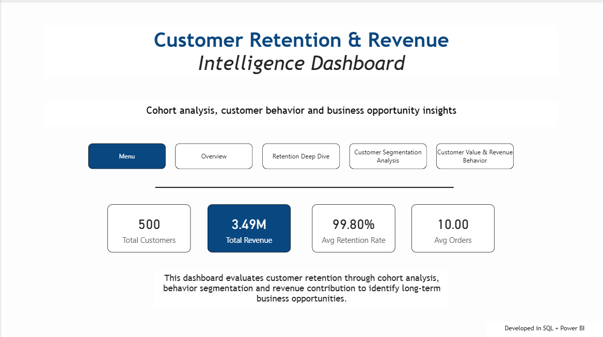
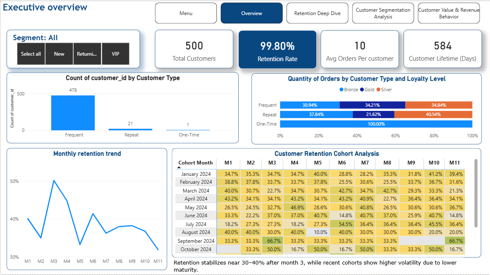
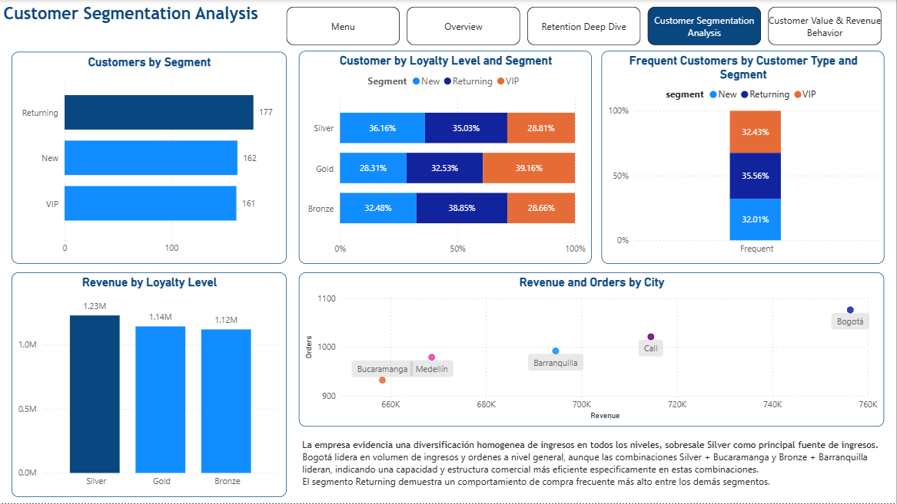

# Customer Retention & Revenue Intelligence Dashboard


[English](#english) | [Español](#español)

# English
## 📸 Menu Preview

## 📸 Executive Overview Preview

## 📸 Customer Segmentation Preview


## Project Overview

This project analyzes customer retention behavior through SQL-based cohort modeling and Power BI dashboard design.

The objective is to identify how customer groups evolve after acquisition, measure retention stability over time, and detect business opportunities through segmentation, purchasing behavior, and revenue contribution.

The project combines:

* SQL data modeling
* Cohort retention analysis
* Customer segmentation
* Executive dashboard storytelling in Power BI

---

## Business Questions Addressed

This analysis answers:

* How many customers return after their first purchase?
* Which cohorts retain customers more effectively over time?
* What customer segments generate stronger long-term value?
* How stable is retention across acquisition periods?
* How does customer behavior impact revenue performance?

---

## Dataset Structure

The project uses three core tables:

### fact_customer_orders

Transactional customer purchase history.

### dim_customers

Customer profile attributes such as:

* loyalty level
* segment
* city
* registration date

### fact_customer_orders

Orders information:

* order id
* customer id
* order date
* quantity
* unit price
* discount

---

## SQL Analytical Process

The SQL workflow includes:

### 1. Customer behavior classification

Customers were classified into:

* One-Time
* Repeat
* Frequent

Using purchase frequency logic:

* 1 order → One-Time
* 2 to 4 orders → Repeat
* 5+ orders → Frequent

---

### 2. Retention rate calculation

Retention rate was defined as:

Customers with more than one order / total customers

---

### 3. Cohort analysis

Customers were grouped by:

First purchase month

Then retention was tracked across monthly indexes:

* M1
* M2
* M3
* M4...

This allowed measuring customer survival behavior over time.

---

## Power BI Dashboard Pages

### Page 1 — Executive Overview

Includes:

* Total customers
* Retention rate
* Average orders
* Customer lifetime
* Customer type distribution

---

### Page 2 — Retention Deep Dive

Includes:

* Cohort heatmap
* Monthly retention trend
* Cohort maturity interpretation

---

### Page 3 — Customer Segmentation Analysis

Includes:

* Customer type by loyalty level
* Segment behavior comparison
* Retention contribution by segment

---

### Page 4 — Customer Value & Revenue Behavior

Includes:

* Revenue by segment
* Revenue contribution by customer type
* Opportunity analysis

---

## Key Analytical Findings

* Retention rate reaches 99.8%
* Frequent customers dominate the base
* Mature cohorts stabilize between 30% and 40% retention after month 3
* Recent cohorts show higher volatility due to lower maturity

---
# Repository Structure

```plaintext
Customer Retention Analysis/
│── README.md
│── queries/
│   ├── day0_Data_Definition_Language.sql
│   ├── day1_EDA.sql
│   ├── day2_Cohort_Analysis.sql
│   ├── day3_Views.sql
│── dataset/
│   ├── fact_orders.csv
│   ├── dim_products.csv
│   ├── dim_customers.csv
│── dashboard/
│   ├── Customer Retention Analysis Dashboard.pbix
│── images/
│   ├── menu-preview.png
│   ├── executive-overview-preview.png
│   ├── customer-segmentation-preview.png
```
---

## Tools Used

* PostgreSQL
* Power BI
* SQL Views

---
# SQL Techniques Applied

* CTEs
* Views
* Aggregations
* Revenue calculations
* Customer segmentation
---

## Dashboard Design Principles

The dashboard was built following:

* executive readability
* clean visual hierarchy
* storytelling structure
* business interpretation focus

---

## 👤 Author

Brandon Gomez Murcia  
Data Analyst | SQL | Power BI | DAX | Power Query

Developed as an end-to-end analytics portfolio project focused on customer retention intelligence.

---
# Español
## 📸 Menu Preview

## 📸 Executive Overview Preview

## 📸 Customer Segmentation Preview


## Resumen del proyecto

Este proyecto analiza el comportamiento de retención de clientes mediante modelado de cohortes basado en SQL y diseño de paneles de Power BI.

El objetivo es identificar cómo evolucionan los grupos de clientes tras su adquisición, medir la estabilidad de la retención a lo largo del tiempo y detectar oportunidades de negocio a través de la segmentación, el comportamiento de compra y la contribución a los ingresos.

El proyecto combina:

* Modelado de datos SQL
* Análisis de retención de cohortes
* Segmentación de clientes
* Presentación de informes en paneles ejecutivos de Power BI

---

## Preguntas de negocio abordadas

Este análisis responde a:

* ¿Cuántos clientes regresan tras su primera compra?

* ¿Qué cohortes retienen a los clientes de forma más eficaz a lo largo del tiempo?

* ¿Qué segmentos de clientes generan mayor valor a largo plazo?

* ¿Qué tan estable es la retención entre los periodos de adquisición?

* ¿Cómo influye el comportamiento del cliente en el rendimiento de los ingresos?

---

## Estructura del conjunto de datos

El proyecto utiliza tres tablas principales:

### fact_customer_orders

Historial de compras transaccionales del cliente.

### dim_customers

Atributos del perfil del cliente, tales como:

* Nivel de fidelización
* Segmento
* Ciudad
* Fecha de registro

### fact_customer_orders

Información de las ordenes:

* id de ordenes
* id de clientes
* fecha de orden
* cantidad
* precio unitario
* descuento
---

## Proceso analítico SQL

El flujo de trabajo SQL incluye:

### 1. Clasificación del comportamiento del cliente

Los clientes se clasificaron en:

* Compra única
* Compra recurrente
* Compra frecuente

Utilizando la lógica de frecuencia de compra:

* 1 pedido → Compra única
* De 2 a 4 pedidos → Compra recurrente
* Más de 5 pedidos → Compra frecuente

---

### 2. Cálculo de la tasa de retención

La tasa de retención se definió como:

Clientes con más de un pedido / Total de clientes

---

### 3. Análisis de cohortes

Los clientes se agruparon por:

Mes de la primera compra

Luego se realizó un seguimiento de la retención en los índices mensuales:

* M1
* M2
* M3
* M4...

Esto permitió medir el comportamiento de supervivencia de los clientes a lo largo del tiempo.


---

## Páginas del panel de Power BI

### Página 1: Resumen ejecutivo

Incluye:

* Total de clientes
* Tasa de retención
* Pedidos promedio
* Vida útil del cliente
* Distribución por tipo de cliente

---

### Página 2: Análisis detallado de la retención

Incluye:

* Mapa de calor de cohortes
* Tendencia de retención mensual
* Interpretación de la madurez de las cohortes

---

### Página 3: Análisis de segmentación de clientes

Incluye:

* Tipo de cliente por nivel de fidelización
* Comparación del comportamiento de los segmentos
* Contribución a la retención por segmento

---

### Página 4: Valor del cliente y comportamiento de los ingresos

Incluye:

* Ingresos por segmento
* Contribución a los ingresos por tipo de cliente
* Análisis de oportunidades

---

## Principales hallazgos analíticos

* La tasa de retención alcanza el 99,8 %
* Los clientes frecuentes predominan en la base
* Las cohortes maduras se estabilizan entre el 30 % y el 40 % de retención después de un mes 3
* Las cohortes recientes muestran mayor volatilidad debido a su menor madurez.

---
# Estructura del repositorio

```texto plano
Customer Retention Analysis/
│── README.md
│── querys/
│ ├── day0_Data_Definition_Language.sql
│ ├── day1_EDA.sql
│ ├── day2_Cohort_Analysis.sql
│ ├── day3_Views.sql
│── dataset/
│ ├── fact_orders.csv
│ ├── dim_products.csv
│ ├── dim_customers.csv
│── dashboard/
│ ├── Customer Retention Analysis Dashboard.pbix
│── images/
│ ├── menu-preview.png
│ ├── executive-overview-preview.png
│ ├── customer-segmentation-preview.png
```
---
## Herramientas utilizadas

* PostgreSQL
* Power BI
* Vistas SQL

---
# Técnicas SQL aplicadas

* CTE
* Vistas
* Agregaciones
* Cálculos de ingresos
* Segmentación de clientes
---
## Principios de diseño del panel

El panel se diseñó siguiendo los siguientes principios:

* legibilidad para ejecutivos
* jerarquía visual clara
* estructura narrativa
* enfoque en la interpretación empresarial

---

## 👤 Autor

Brandon Gomez Murcia
Analista de datos | SQL | Power BI | DAX | Power Query

Desarrollado como un proyecto integral de análisis de datos enfocado en la inteligencia de retención de clientes.